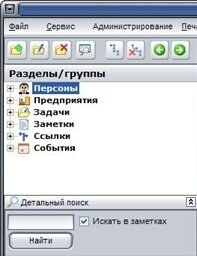
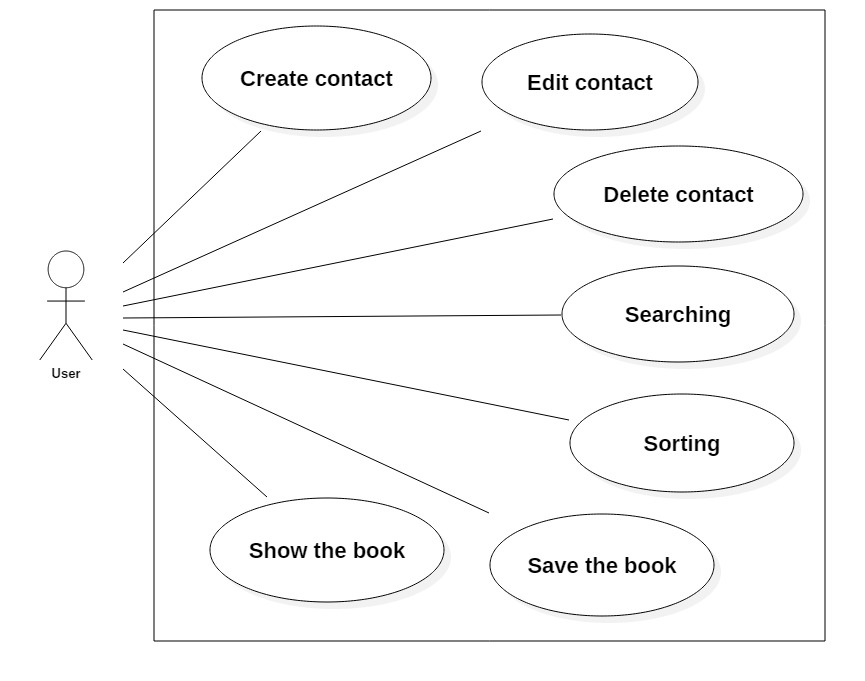

# ContactBook

## Задание (Task)
Книга контактов

Необходимо написать программу, которая будет генерировать список контактов в алфавитном порядке. Список будет автоматически сохраняться системой перед выходом пользователя из программы. Пользователь сможет добавлять, редактировать и удалять контакты, сохранять книгу после внесенных изменений.

## Концепция (Vision statement)

Успешная программа будет считывать данные о контактах из файла и выводить список контактов в алфавитном порядке на экран с их номерами телефонов.

Примерный вариант отображения списка контактов:

Также в программе будет реализован поиск контактов и деление их на группы (деление может быть осуществлено самим пользователем для удобства). 

Примерный вариант отображения деления на группы и поиска:

## Минимально работоспособный продукт (Minimum viable product)
Программа будет выводить список контактов в консоль. Также будет осуществлено добавление и удаление контактов.

## Диаграмма прецедентов использования

## Диаграмма последовательностей

## Диаграмма компонентов

