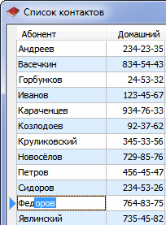
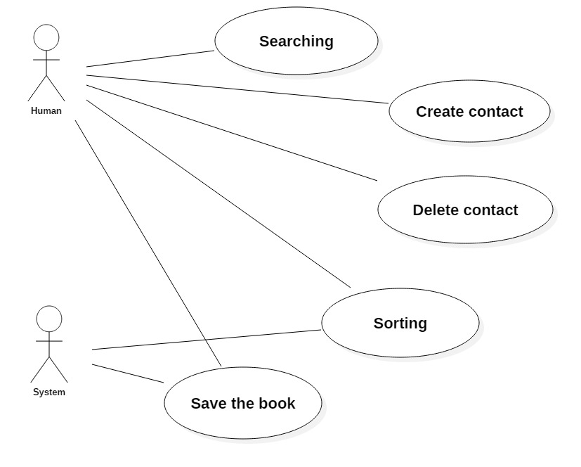
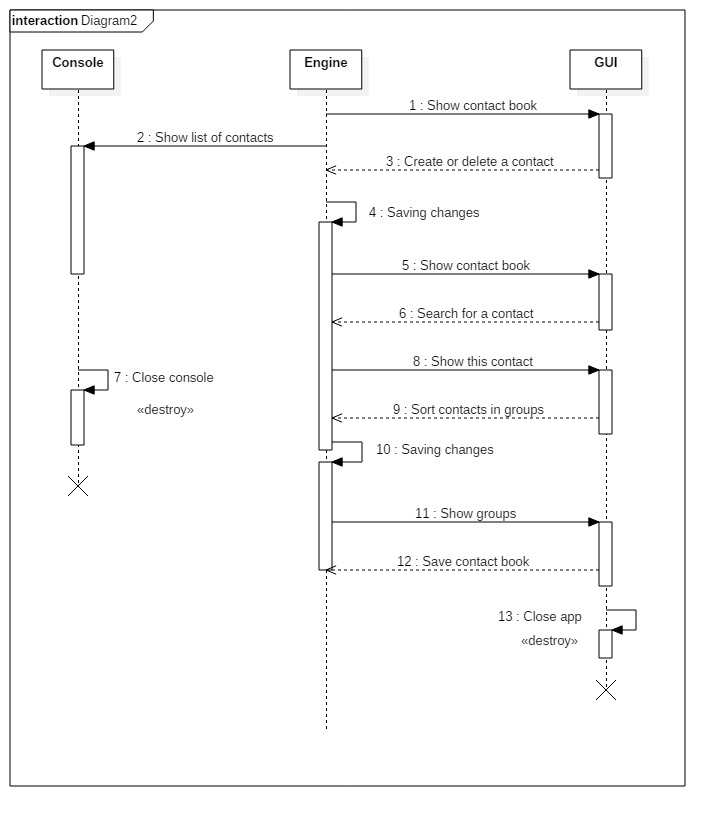
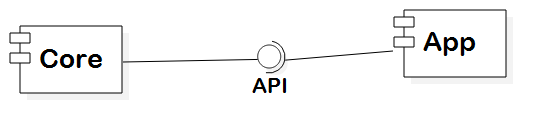

# ContactBook

## Задание (Task)
Книга контактов (Contact Book)

//Второй абзац -- что определено вами (выбранные исчерпывающие правила игры, требования к модели, редактору и т.п.)

## Концепция (Vision statement)

Успешная программа должна выводить список контактов в алфавитном порядке на экран с их номерами телефонов. (Если заказчику будет необходима дополнительная информация о каждом контакте (например, адрес), помимо номера телефона, то она будет добавлена)

Примерный вариант отображения списка контактов:

Также в программе будет реализован поиск контактов и деление их на группы (деление может быть осуществлено самим пользователем для удобства). 

Примерный вариант отображения деления на группы и поиска:

//Создается с точки зрения заказчика и конечных пользователей. Цель артефакта -- описать, как должен выглядеть успешный результат //проекта. Иначе говоря, если проект завершается успешно, то как в этом случае должен выглядеть готовый продукт? Какими он обладает //ключевыми характеристиками и функциями и как они могуть помочь пользователям выполнять их задачи? Концепция определяет на уровне //руководства, в каком случае руководство может признать, что цель работы достигнута.

## Минимально работоспособный продукт (Minimum viable product)
https://en.wikipedia.org/wiki/Minimum_viable_product

## Диаграмма прецедентов использования

## Диаграмма последовательностей

## Диаграмма компонентов

