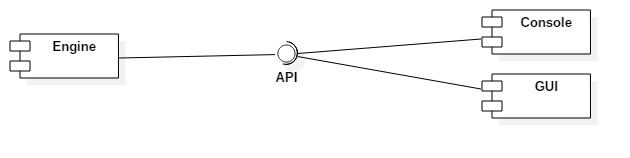

# ContactBook

## Задание (Task)
Книга контактов

Программа будет генерировать список контактов в алфавитном порядке, который будет автоматически сохраняться системой перед выходом пользователя из программы. Пользователь сможет добавлять и удалять контакты, сохранять книгу после внесенных изменений.

## Концепция (Vision statement)

Успешная программа должна выводить список контактов в алфавитном порядке на экран с их номерами телефонов. Если заказчику будет необходима дополнительная информация о каждом контакте (например, адрес), помимо номера телефона, то она будет добавлена.

Примерный вариант отображения списка контактов:

Также в программе будет реализован поиск контактов и деление их на группы (деление может быть осуществлено самим пользователем для удобства). 

Примерный вариант отображения деления на группы и поиска:

## Минимально работоспособный продукт (Minimum viable product)
Программа должна выводить список контактов в консоль или файл.

## Диаграмма прецедентов использования

## Диаграмма последовательностей

## Диаграмма компонентов

